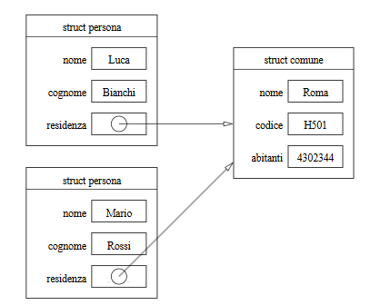
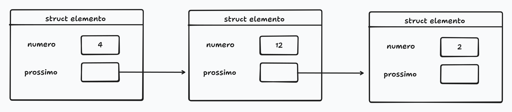
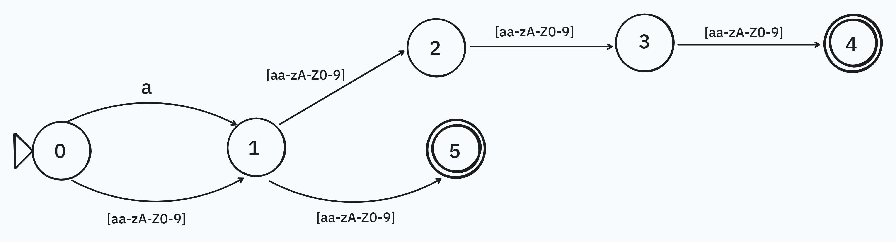
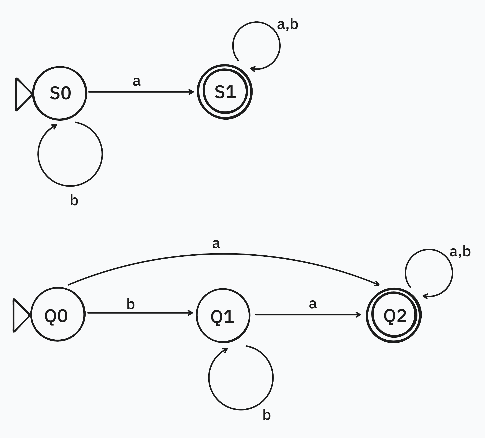
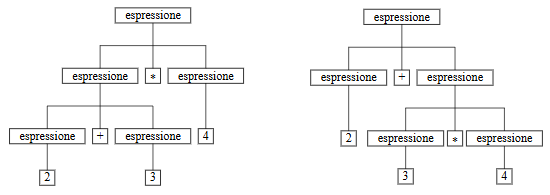
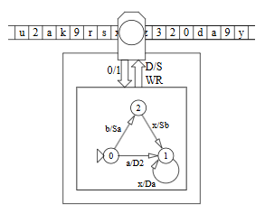

### Indirizzi

- scrivere le istruzioni C per stampare valore e indirizzo di una variabile

```C
int a;
printf("%\d", a);
printf("%\d", &a);
```
- scrivere le istruzioni C che memorizzano l'indirizzo di una variabile a in una variabile b e che stampano poi il valore di b

```C
int a;
int *b;
b = &a;
printf("%d\n", *b);
```

- dopo aver eseguito queste istruzioni C, la variabile a ha valore indefinito? e la variabile b?
```C
int a;
int *b;
b=&a;
```

>La variabile a è stata solo inizializzata ma non ha ancora un valore assegnato; b invece ha come valore l'indirizzo in memoria della variabile a.

### Strutture

- disegnare una rappresentazione grafica di due strutture che puntano entrambe a una terza



- scrivere la dichiarazione di una struttura "Cane" che contiene nome e razza, scrivere anche la dichiarazione della struttura "Razza", che contiene nome e vita media in anni

```Java
Class Cane {
    String nome;
    String razza;
}

Class Razza {
    String nome;
    int vita_media;
}
```

- disegnare una rappresentazione grafica della lista di tre interi 4,12,2 in C



### Tipi

- mostrare un esempio in cui un programma Java dà errore in compilazione, ma non lo darebbe se Java avesse la tipizzazione ad anatra

```Java
class Primo {
    int x;

}
class Secondo {
    int x;
}

class Main {
    static void azzera(Primo a) {
        a.x = 0;
    }

    public static void main(String[] args) {
        Primo a = new Primo();
        a.x = 12;
        azzera(a)

        Secondo b = new Secondo();
        b.x = 12;
        azzera(b);
    }
}
```
>In questo caso l'errore è nell'ultima istruzione, perché nonostante il metodo azzera possa azzerare qualunque oggetto con componente x, non accetta l'oggetto b perché non è di tipo Primo.

- quali sono i vantaggi e gli svantaggi dei due modi di riconoscere i tipi?

>I vantaggi della tipizzazione ad anatra (come in Python) sono una maggiore velocità e facilità di scrittura dei programmi, mentre gli svantaggi includono una maggiore difficoltà di debugging, essendo gli errori rilevati solamente in fase di esecuzione. Per quanto riguarda la tipizzazione dichiarativa, il vantaggio principale è una maggiore sicurezza dal punto di vista delle caratteristiche degli oggetti dichiarati, che può tradursi in maggiore affidabilità dell'applicativo sviluppato; inoltre, gli eventuali errori vengono colti immediatamente in fase di compilazione. Lo svantaggio è una maggiore complessità sintattica e di lettura del codice.

### Rappresentazione dei dati

- convertire i numeri 10, 3 e 9 in binario; sommare il primo con il secondo, al risultato sottrarre il terzo; queste operazioni vanno effettuate in binario.

>10/2 = 5 r 0 -> 5/2 = 2 r 1 -> 2/2 = 1 r 0 -> 1/2 = 0 r 1 -> 10 (b10) = 1010 (b2)  
3/2 = 1 r 1 -> 1/2 = 0 r 1 -> 3 (b10) = 11 (b2)  
9/2 = 4 r 1 -> 4/2 = 2 r 0 -> 2/2 = 1 r 0 -> 1/2 = 0 r 1 -> 9 (b10) = 1001 (b2)  
1010 + 1001 = 1101  
1101 - 1001 = 0100  
0100 (b2) -> $0*2^3 + 1*2^2 + 0*2^1 + 0*2^0$ = 0 + 4 + 0 + 0 = 4

- quanti bit servono per rappresentare la somma di quattro numeri senza segno, ognuno rappresentabile con tre bit?

>Siccome il valore massimo rappresentabile con 3 bit senza segno è 7, il massimo valore che la somma di quattro numeri a 3 bit è 28. Per poter rappresentare il numero 28 abbiamo bisogno di 5 bit, poiché con 4 bit il valore massimo rappresentabile sarebbe $2^4 -1 = 15$, mentre con 5 abbiamo $2^5 -1 = 31$. Questo garantisce di non incappare in overflow.

### Grafi

- come si rappresenta in Python il grafo K3?

```Python
# data la classe Grafo
class Grafo:
    def __init__(self, nodi, archi):
        self.nodi = nodi
        self.archi = archi

grafo = Grafo({1, 2, 3}, {(1, 2), (2, 3), (3, 1)})
```

### Espressioni regolari

- scrivere l'espressione regolare che collima con le stringhe che contenegono almeno una cifra fra uno e cinque seguita da quel numero di a; Una stringa di questo genere è per esempio arfg3aaabndf, dato che 3 è seguito da tre a; i caratteri possibili sono cifre e lettere minuscole.

```Python
[a-z0-9]*(1a|2aa|3aaa|4aaaa|5aaaaa)[a-z0-9]*
```

- data l'espressione regolare ab+, scrivere l'espressione che collima con le stesse stringhe tranne abb

```Python
(ab|ab{3,})
# oppure
ab|abbb+
``` 

### Automi

- disegnare l'automa che accetta tutte e sole le stringhe di lunghezza due, e tutte quelle che iniziano con a che sono lunghe quattro



- disegnare due automi diversi che accettano esattamente le stesse stringhe (ossia ogni stringa accettata dal primo è accettata dal secondo e viceversa)

>Questi due automi, anche se diversi da un punto di vista costruttivo, accettano le stesse stringhe, ovvero le stringhe composte dall'alfabeto {a,b} che contengono almeno una a


### Grammatiche

- dire quali stringhe sono generate dalla seguente grammatica (X è il simbolo iniziale, le maiuscole indicano i simboli non terminali)  
X -> Y  
X -> Z  
Y -> X  
Z -> ab  
Z -> a  

>La grammatica genera esattamente le due stringhe "a" e "ab".

- dare la definizione di grammatica ambigua; fornire un esempio di grammatica ambigua e una non ambigua

>Una grammatica in cui esistono stringhe che hanno più di un albero di derivazione si dice ambigua. Ad esempio, la formula 2+3*4 senza si può ottenere in due modi diversi:
  
>Nel primo caso il risultato è $(2+3)*4$, mentre nel secondo è $2+(3*4)$, ma chiaramente solo il secondo è corretto (rispetto alla formula originale).

- scrivere la grammatica che genera tutte e sole le stringhe nella forma abbbbba, dove il numero di b è arbitrario

> X -> a Y a  
Y -> b Y  
Y -> ε (stringa vuota) 

### Complessità e calcolabilità

- fornire la definizione di insieme contabile; dimostrare che l'insieme dei numeri pari è contabile

>Un insieme è definito numerabile se i suoi elementi sono in numero finito oppure se possono essere messi in corrispondenza biunivoca con i numeri naturali. Per dimostrare che l'insieme dei numeri pari è contabile è necessario individuare una qualsiasi biezione tra $P$ e $\mathbb{N}$, ad esempio l'applicazione $f:\mathbb{N} \to P$ che a ogni elemento $n\in \mathbb{N}$ associa il suo doppio. L'espressione analitica della legge è $f(n) = 2n$, e si vede che $f$ soddisfa la definizione di corrispondenza biunivoca.

- disegnare una macchina di Turing, e spiegare in poche righe come funziona

>Una macchina di Turing è una macchina che può risolvere problemi di decisione (risposta 0/1) su stringhe. È composta da un nastro di lunghezza illimitata, una testina che si muove sul nastro (di una posizione a destra o a sinistra) e che può leggere e sovrascrivere la cella su cui si trova. È definita formalmente da: un alfabeto per i simboli sul nastro, un insieme di stati possibili (ovvero uno stato iniziale e due finali), una funzione di transizione e un output. La funzione di transizione è espressa attraverso un automa contenuto nell'unità di controllo collegata alla testina.

